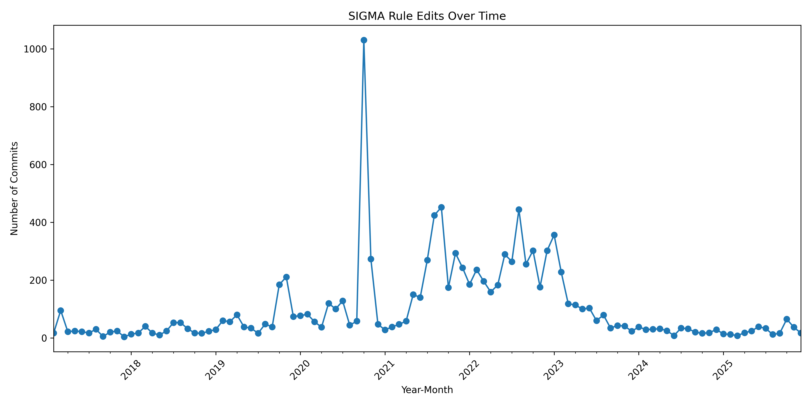
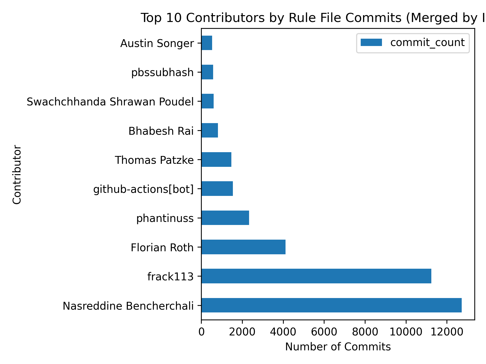
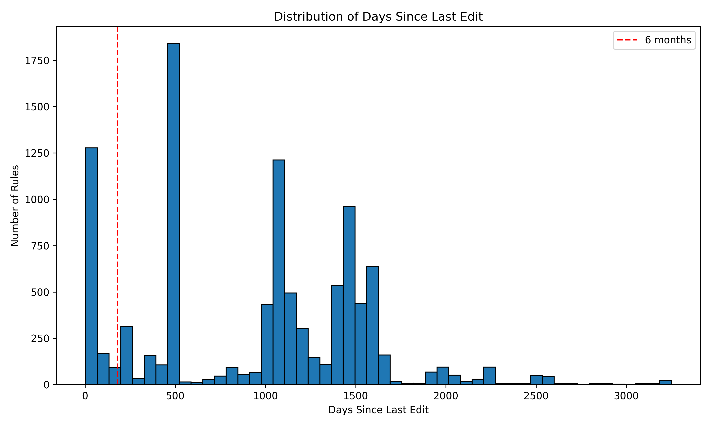
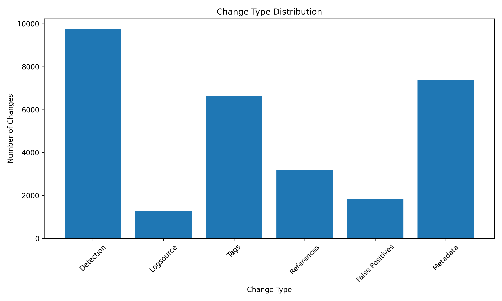

# SIGMA Rule Longitudinal Analysis

A comprehensive analysis pipeline for studying the evolution of SIGMA detection rules over time. This project extracts commit history, builds a rule snapshot database, parses YAML content, computes version diffs, fetches external reference dates, and generates reports on rule evolution, contributors, and change patterns.

---

## Table of Contents

1. [Initial Findings](#initial-findings)
2. [Quick Start](#quick-start)
3. [Project Structure](#project-structure)
4. [Pipeline Phases](#pipeline-phases)
5. [Database Schema](#database-schema)
6. [Performance & Reliability](#performance--reliability)
7. [Usage Examples](#usage-examples)
8. [Troubleshooting](#troubleshooting)
9. [Extensibility](#extensibility)

---

## Initial Findings

### Repository Overview

- **Total rule YAML files**: 10,282
- **Total commits touching rules**: 10,727
- **Total rule versions**: 45,696

### Edits Over Time

The following chart shows the timeline of rule edits across the SIGMA repository history:



### Most Edited Rules (Top 10)

| Rank | Rule File | Edits |
|------|-----------|-------|
| 1 | `rules/windows/process_access/sysmon_in_memory_assembly_execution.yml` | 44 |
| 2 | `rules/proxy/proxy_ua_apt.yml` | 41 |
| 3 | `rules/windows/builtin/win_alert_mimikatz_keywords.yml` | 39 |
| 4 | `rules/windows/image_load/image_load_side_load_from_non_system_location.yml` | 38 |
| 5 | `rules/windows/powershell/powershell_script/posh_ps_malicious_commandlets.yml` | 37 |
| 6 | `rules/windows/builtin/win_susp_process_creations.yml` | 33 |
| 7 | `rules/windows/registry/registry_set/registry_set_asep_reg_keys_modification_currentversion.yml` | 32 |
| 8 | `rules/windows/powershell/powershell_cmdline_specific_comb_methods.yml` | 31 |
| 9 | `rules/windows/process_access/sysmon_cred_dump_lsass_access.yml` | 30 |
| 10 | `rules/windows/process_access/proc_access_win_direct_syscall_ntopenprocess.yml` | 30 |

### Top Contributors

Contributors are merged by person (not by email) to provide a cleaner view. Some contributors appear under multiple emails (e.g., GitHub noreply + personal). These have been merged for accurate contributor distribution.



| Rank | Contributor | Commits | Share |
|------|-------------|---------|-------|
| 1 | Nasreddine Bencherchali | 12,720 | 27.8% |
| 2 | frack113 | 11,242 | 24.6% |
| 3 | Florian Roth | 4,119 | 9.0% |
| 4 | phantinuss | 2,329 | 5.1% |
| 5 | github-actions[bot] | 1,546 | 3.4% |
| 6 | Thomas Patzke | 1,468 | 3.2% |
| 7 | Bhabesh Rai | 811 | 1.8% |
| 8 | Swachchhanda Shrawan Poudel | 601 | 1.3% |
| 9 | pbssubhash | 579 | 1.3% |
| 10 | Austin Songer | 530 | 1.2% |

### Lifecycle Signals

- **Rules stable for 6+ months**: 8,786 (85.5%)
- **Average days since last edit**: 952.3
- **Median days since last edit**: 1,063.0

The majority of SIGMA rules are stable, with most rules not being modified for over 6 months. This suggests a mature rulebase with established detection patterns.



### Change Taxonomy

Out of 35,410 total changes across all rule versions:



| Change Type | Count | Percentage |
|-------------|-------|------------|
| Detection logic changes | 9,748 | 27.5% |
| Metadata changes | 7,384 | 20.9% |
| Tags changes | 6,651 | 18.8% |
| References changes | 3,195 | 9.0% |
| False positives changes | 1,837 | 5.2% |
| Logsource changes | 1,277 | 3.6% |

Detection logic changes represent the largest category, indicating active refinement of rule detection capabilities. Metadata and tags changes are also significant, suggesting ongoing maintenance and categorization efforts.

### YAML-Level Author Data

- **Rule versions with author field**: 43,967 (96.2%)
- **Rule versions with modified field**: 25,415 (55.6%)

**Top Authors** (by rule versions):
1. Florian Roth - 5,218 versions
2. frack113 - 4,050 versions
3. Nasreddine Bencherchali (Nextron Systems) - 3,212 versions

### External Dates Coverage

- **ATT&CK techniques**: 248/252 with dates (98.4%)
- **CVEs**: 69/182 with dates (37.9%)
- **Threat Reports**: 32/230 with dates (13.9%)

### Methodology

This analysis is based on a comprehensive extraction of the SIGMA repository's Git history, parsing all rule versions, and computing diffs between consecutive versions. External references (ATT&CK techniques, CVEs, threat reports) have been extracted and their publication dates fetched for future responsiveness analysis.

---

## Quick Start

### Prerequisites

- **Python 3.8+** installed
- **Git** installed (for cloning repository and git operations)

### Setup Steps

#### 1. Clone the SIGMA Repository

```bash
git clone https://github.com/SigmaHQ/sigma.git
```

This will create a `sigma/` directory with the full repository history.

#### 2. Install Dependencies

```bash
pip install -r requirements.txt
```

#### 3. Run the Analysis Pipeline

**Option A: Run All Phases (Recommended for first run)**

```bash
python main.py --repo-path sigma
```

This will:
- Phase 1: Extract all commits touching rule files
- Phase 2: Build snapshots of each rule at each commit
- Phase 3: Parse YAML into structured fields
- Phase 4: Compute diffs between versions
- Phase 5: Generate initial findings report
- Phase 6: Fetch external reference dates

**Option B: Run Phases Incrementally**

```bash
# Phase 1 only
python main.py --repo-path sigma --phase 1

# Phase 2 only (requires Phase 1)
python main.py --repo-path sigma --phase 2

# Phase 3 only (requires Phase 2)
python main.py --repo-path sigma --phase 3

# Phase 4 only (requires Phase 3)
python main.py --repo-path sigma --phase 4

# Phase 5 only (requires Phase 4)
python main.py --repo-path sigma --phase 5

# Phase 6 only (requires Phase 3)
python main.py --repo-path sigma --phase 6
```

**Option C: Skip Phase 1 (if already extracted)**

```bash
python main.py --repo-path sigma --skip-phase1
```

#### 4. Check Database Status

```bash
python scripts/check_status.py
```

---

## Project Structure

```
task_sigma/
├── main.py                              # Main pipeline orchestrator
├── requirements.txt                     # Python dependencies
├── README.md                            # This file
├── .gitignore                           # Git ignore rules
├── scripts/                             # Analysis scripts
│   ├── __init__.py
│   ├── phase1_extract_commits.py        # Extract commit history
│   ├── phase2_build_snapshots.py        # Build rule snapshots
│   ├── phase3_parse_yaml.py             # Parse YAML fields
│   ├── phase4_compute_diffs.py          # Compute version diffs
│   ├── phase5_generate_report.py        # Generate reports
│   ├── phase6_fetch_external_dates.py   # Fetch external dates
│   └── check_status.py                  # Database status utility
├── data/                                # Database (created at runtime)
│   └── sigma_analysis.db
└── reports/                             # Generated reports (created at runtime)
    ├── summary_report.txt
    ├── top_edited_rules.csv
    ├── top_contributors_merged.csv
    ├── edits_per_month.csv
    ├── change_taxonomy_summary.csv
    ├── lifecycle_summary.csv
    ├── edits_over_time.png
    ├── top_contributors.png
    ├── change_taxonomy.png
    └── days_since_edit.png
```

---

## Pipeline Phases

### Phase 1: Extract Commit History

**File**: `scripts/phase1_extract_commits.py`

- Uses PyDriller to traverse all commits in the repository
- Filters commits that touch YAML rule files (in `rules/` directories)
- Creates two tables:
  - `commits`: Commit metadata (hash, author, date, message)
  - `commit_files`: Mapping of commits to files they touch
- Handles incremental updates (skips already processed commits)

**Output**: `commits` and `commit_files` tables in database

---

### Phase 2: Build Rule Snapshot Database

**File**: `scripts/phase2_build_snapshots.py`

- For each file-commit pair from Phase 1, extracts file content at that commit
- Uses `git cat-file -p` for fast object access
- Creates tables:
  - `rule_files`: Metadata about each rule file (first/last seen dates)
  - `rule_versions`: All versions of each rule (raw YAML text)
- Handles files that don't exist at certain commits gracefully

**Output**: `rule_versions` table with raw YAML content

**Performance**: 8x faster with parallel processing and batch operations

---

### Phase 3: Parse YAML into Structured Fields

**File**: `scripts/phase3_parse_yaml.py`

- Parses YAML text from `rule_versions` table
- Extracts structured fields:
  - `rule_id`, `title`, `status`, `level`
  - `author`, `date`, `modified` (YAML-level metadata)
  - `logsource_product`, `logsource_category`, `logsource_service`
  - `tags`, `references`, `falsepositives`, `detection` (JSON)
- Handles parse errors gracefully (stores `parse_error` flag)

**Output**: Updated `rule_versions` table with parsed fields

**Success Rate**: 99.96% (only 0.04% parse errors)

---

### Phase 4: Compute Diffs Between Versions

**File**: `scripts/phase4_compute_diffs.py`

- For each rule file, compares consecutive versions
- Classifies changes:
  - `detection_changed`: Detection logic modified
  - `logsource_changed`: Logsource fields changed
  - `tags_changed`: Tags modified
  - `references_changed`: References updated
  - `falsepositives_changed`: False positives updated
  - `metadata_changed`: Title/status/level/ID changed
- Computes line-level metrics: `lines_added`, `lines_deleted`

**Output**: `version_diffs` table with change classifications

---

### Phase 5: Generate Initial Findings Report

**File**: `scripts/phase5_generate_report.py`

Generates comprehensive reports:
1. **Repo Overview**: Total rules, commits, edits over time
2. **Most Edited Rules**: Top 10 by commit count
3. **Top Contributors**: Top 10 with share percentages (merged by identity)
4. **Lifecycle Signals**: Stability metrics, days since last edit
5. **Change Taxonomy**: Distribution of change types

**Outputs**:
- `top_edited_rules.csv` - Most frequently edited rules
- `top_contributors_merged.csv` - Top contributors (merged by identity)
- `edits_per_month.csv` - Commit activity timeline
- `change_taxonomy_summary.csv` - Change type breakdown
- `lifecycle_summary.csv` - Rule stability metrics
- PNG visualizations (see [Initial Findings](#initial-findings))

---

### Phase 6: Fetch External Dates

**File**: `scripts/phase6_fetch_external_dates.py`

Extracts and fetches publication dates for external references:
- **ATT&CK techniques**: From MITRE ATT&CK API
- **CVEs**: From NVD API (with retry logic)
- **Threat reports**: From URL patterns and HTML metadata

**Output**: `attack_techniques`, `cves`, `threat_reports`, and `rule_external_refs` tables

**Purpose**: Enable responsiveness analysis (time between external event and rule update)

**Features**:
- Retry logic (3 attempts) for rate limits and timeouts
- HTML metadata extraction (og:published_time, article:published_time)
- Content-based date extraction as fallback

---

## Database Schema

### `commits`
- `commit_hash` (PK)
- `author_name`, `author_email`
- `commit_datetime`
- `commit_message`

### `commit_files`
- `commit_hash` (FK → commits)
- `file_path`
- Primary key: (commit_hash, file_path)

### `rule_files`
- `file_path` (PK)
- `first_seen_date`, `last_seen_date`

### `rule_versions`
- `file_path`, `commit_hash` (PK)
- `date` (commit date)
- `yaml_text` (raw YAML)
- Parsed fields: `rule_id`, `title`, `status`, `level`
- YAML-level fields: `author`, `modified` (from YAML metadata)
- `logsource_product`, `logsource_category`, `logsource_service`
- `tags`, `references`, `falsepositives`, `detection` (JSON)
- `parse_error` (0/1 flag)

### `version_diffs`
- `file_path`, `old_commit`, `new_commit` (PK)
- `date`
- Change flags: `detection_changed`, `logsource_changed`, `tags_changed`, etc.
- Metrics: `lines_added`, `lines_deleted`

### `attack_techniques`
- `technique_id` (PK)
- `created_date`, `modified_date`, `name`
- `last_fetched`

### `cves`
- `cve_id` (PK)
- `published_date`, `description`
- `last_fetched`

### `threat_reports`
- `url` (PK)
- `domain`, `source`, `publication_date`
- `last_fetched`

### `rule_external_refs`
- Links rule versions to external references

---

## Performance & Reliability

The pipeline has been optimized for high throughput and low error rates:

### Phase 2 Optimizations
- **Processing Speed**: 8x faster (33 minutes → 4 minutes)
- **Throughput**: 5.19 it/s → 41.25 it/s (8x improvement)
- **Success Rate**: 99.99% (45,691/45,696 rule versions successfully extracted)
- **Error Rate**: Reduced from 411 errors to just 5 errors (98.8% reduction)

**Key Optimizations:**
- Switched from `git show` to `git cat-file -p` for faster object access
- Increased parallel workers from 16 to 32
- Implemented batch database operations (executemany for bulk inserts)
- Added database indexes and optimized SQLite settings (WAL mode, larger cache)

### Phase 3 Results
- **Success Rate**: 99.96% (42,276/42,294 rule versions successfully parsed)
- **Parse Error Rate**: Only 18 errors (0.04% error rate)
- **Processing Time**: ~2 minutes for 42K+ rule versions

### Expected Runtime

| Phase | Description | Time |
|-------|-------------|------|
| Phase 1 | Extract commits | ~5-15 min |
| Phase 2 | Build snapshots | ~4-10 min |
| Phase 3 | Parse YAML | ~2-5 min |
| Phase 4 | Compute diffs | ~10-20 min |
| Phase 5 | Generate reports | <1 min |
| Phase 6 | Fetch external dates | ~5-30 min |
| **Total** | Full pipeline | **~30-60 min** |

---

## Usage Examples

### Full Pipeline

```bash
python main.py --repo-path sigma
```

### Individual Phases

```bash
python main.py --repo-path sigma --phase 1
python main.py --repo-path sigma --phase 2
# etc.
```

### Check Status

```bash
python scripts/check_status.py
```

### Direct Script Execution

```bash
# Run Phase 3 to extract YAML fields
python scripts/phase3_parse_yaml.py data/sigma_analysis.db

# Run Phase 6 to get external dates
python scripts/phase6_fetch_external_dates.py --db-path data/sigma_analysis.db
```

---

## Troubleshooting

### "Repository not found"
- Make sure you've cloned the SIGMA repository
- Check the path: `python main.py --repo-path /path/to/sigma`

### "Database locked"
- Another process might be using the database
- Wait for previous run to complete

### Out of Memory
- Phase 2 can be memory-intensive
- Consider running phases separately
- The database commits periodically to manage memory

### Git errors
- Ensure git is installed and in PATH
- The repository should have full history (use `git clone`, not download ZIP)

### Python not found
- Use the full path to Python: `C:\Python312\python.exe main.py`
- Or add Python to your PATH

---

## Extensibility

The pipeline is designed to be extended:

1. **Additional Analyses**: Add new scripts in `scripts/` directory
2. **Custom Queries**: Query the SQLite database directly
3. **New Report Types**: Extend `phase5_generate_report.py`
4. **Additional Metrics**: Add columns to database tables

### Future Phases (Planned)

Based on the original plan, future phases could include:

- **Analysis 1**: Rule lifecycle (survival curves)
- **Analysis 2**: Modification taxonomy (ML classification)
- **Analysis 3**: Threat responsiveness (CVE/ATT&CK lag times)
- **Analysis 4**: Coverage gaps (ATT&CK matrix mapping)
- **Analysis 5**: Contributor behavior analysis
- **Analysis 6**: Quality prediction model

The current implementation provides the foundation for all these analyses.

---

## Data Files

All supporting data is available in the `reports/` directory:

### CSV Files
- `top_edited_rules.csv` - Most frequently edited rules
- `top_contributors_merged.csv` - Top contributors with merged identities
- `edits_per_month.csv` - Commit activity over time
- `change_taxonomy_summary.csv` - Breakdown of change types
- `lifecycle_summary.csv` - Rule stability metrics

### Visualizations
- `edits_over_time.png` - Timeline of rule edits
- `top_contributors.png` - Contributor distribution chart
- `change_taxonomy.png` - Change type distribution
- `days_since_edit.png` - Distribution of rule stability

---

## License

This analysis tool is provided as-is for academic and research purposes.

The SIGMA rules themselves are licensed under the [SIGMA license](https://github.com/SigmaHQ/sigma/blob/master/LICENSE).
